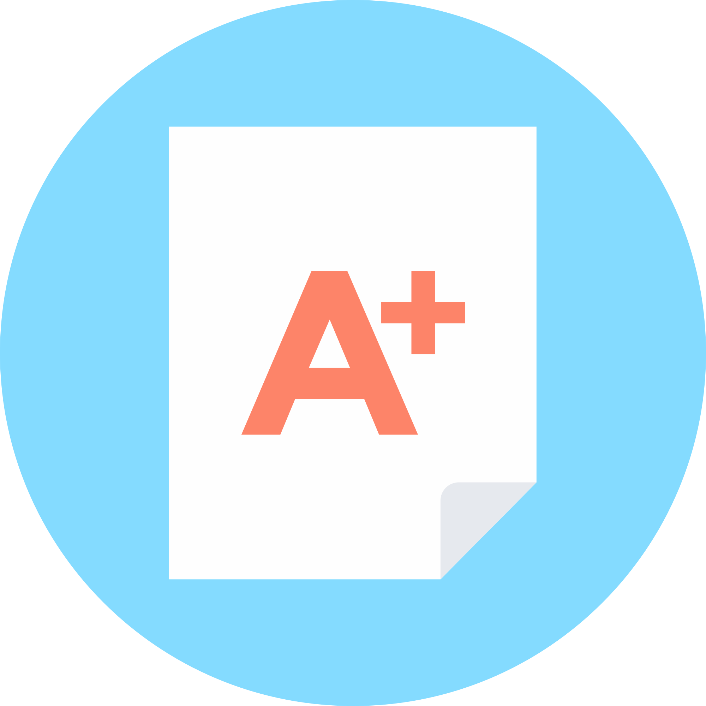

#  The Participation Grade:
## How I went from from a High School dropout to a successful ICS College student.

Growing up, I hated school. Well, I wouldn’t say I hated it, I just chose not to participate. So when I was old enough, I took up the opportunity to dropout of high school. Who would have thought that seven years later, I would be pursuing a B.S in Computer Science?

## Failure to Launch
  My lack of school enthusiasm started before I can remember. Even when I was in elementary school, I had straight Ds because they wouldn’t give out Fs. Middle school was much of the same, with some of my grades being in the teens. By the time I reached high school, I was skipping class to hang out with the wrong crowd and make poor life choices. I ended up a high school dropout with a dead-end job working in a restaurant. 

## A New Direction
  Then something amazing happened. See my sister had a much different approach to learning. In fact, she excelled at it. She ended up with her Doctorate in Mathematics, and had a career as a junior professor at UH Manoa on the island of Oahu, HI. She so kindly offered to help me move to Hawaii from my hometown in Massachusetts, so that I could get my degree and turn my life around. I knew that restaurant work was always gonna be available, so I took the plunge, and moved to Honolulu on my twenty first birthday.

  After getting myself established, I started attending Kapiolani Community College as a pre-marketing major. Before I was able to pick my classes, I had to take a placement test for math and english. Luckily I got into English 100, but for math I did terribly and only got into Math 25, the second to lowest math class available. 

## First Day of School!
  During my first semester, I did something that I had never done before in my life: truly applied myself. A couple of things happened during that semester. I realised that when I tried, I actually loved school. I also realized that I loved math. Even though we worked on simple topics, it was fun! By the time my first semester ended, I knew I had to change my major to either Mathematics or something math related.

  I had a lot of math ahead of me if I was going to pursue a degree in Mathematics. Luckily for me, KCC offered an accelerated math course for engineering students. The head of the program allowed me in to the course, which included three math courses and a research project of my choice. On a gut feeling, I chose the ICS project, which was to use the Perl programming language to calculate the center of mass of Oahu. I was instantly hooked. It was so fun to build and create using software that I knew right away that this was my path in life: to be a software engineer.

## Looking Forward
  Currently I am a sophomore UH Manoa. My passion for Computer Science grows every day. Many CS topics interest me, and I have experimented with web development, data science, and integrated systems. The most interesting things about CS to me are developing and maintaining large software systems, and solving hard problems. Hopefully one day I’ll be able to work on these things. I am forever grateful to my sister, and to all the professors and faculty that have helped me on my journey. My ultimate goal in life is to one day help someone like they have helped me. They taught me to get the most out of life, I had to, well, participate.
