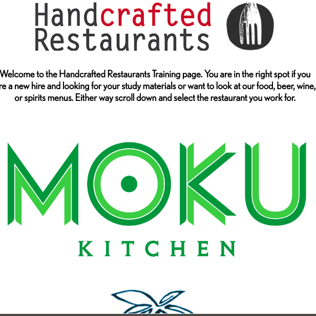
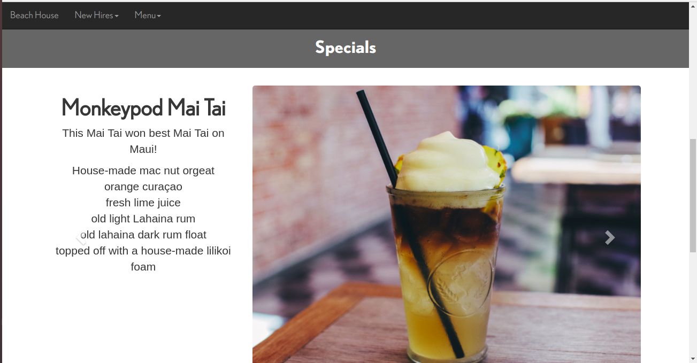
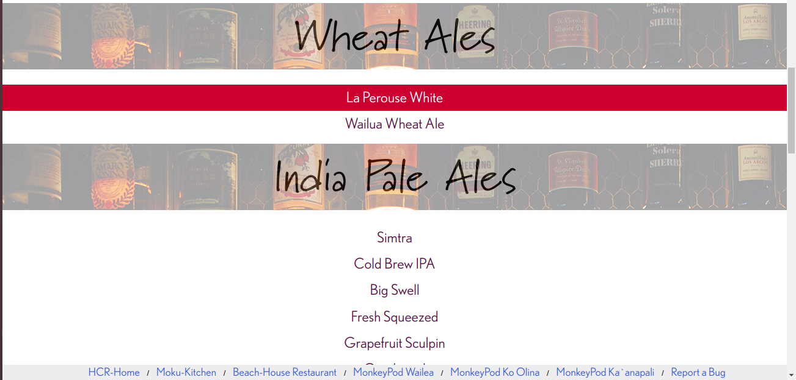

  
  
  
  

HCR Online Training is a web application used to train new and existing employees working for the Handcrafted Restaurant Group (HCR), which is comprised of five high volume restaurants. Nearly all  components of the project's web pages are custimizable via an admin page. The project is deployed using the Django web framework, and is written in Python, HTML, CSS, and JavaSript. The project is hosted on an Apache http server provided by DreamHost. The project's datebase schema is implemented using MySQL.

Under the Django framework paridigm, the project's components are broken down into "apps". The following apps for this project include:

Homepages - A restaurants landing page where employees can view the current running food and drink specials and updates.

Menus - Where employees can learn in detail about food and beverage menu items. 

training - Provides position specific study material for new employees to pass hiring exams. 

HCR items - A repository for comanpany specific items, such as recipes.

Each app has a corresponding admin and database interface. 
 
My partner and I learned how to collaberate effectivly on a larger software project that involved months of work. We also submitted a successful buisness proposal. We Learned alot about web developement as this was our first web project. Currently, the project's site and repository is private due to client's request.

