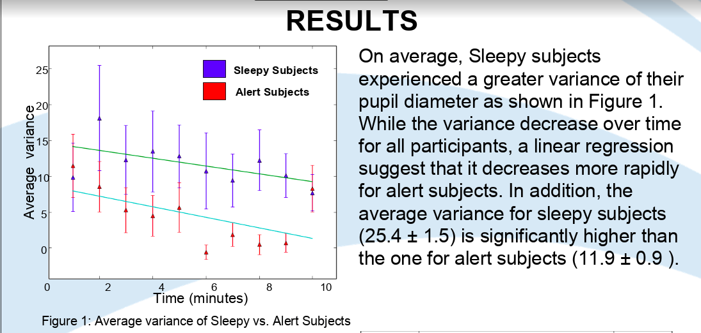
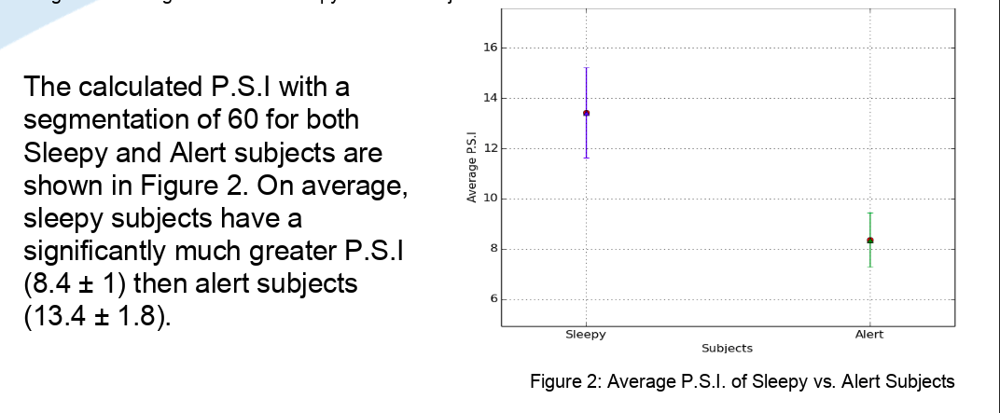

The purpose of this project was to determine if there was a strong correlation between Excessive Daytime Sleepiness (EDS) and the fluctuation of the pupil over time.

Over 40 participants each had their pupil diameter mesured in a dark room for fifteen minutes using an infared camera at a rate of 60HZ (The first five minutes were disregarded for acclimation). The participants then filled out a standardized written survey known as the Epworth Sleepiness Scale (ESS) to determine which participants were experiencing EDS. The participants where then divided into two groups: "sleepy" and "alert". The dataset for each group was then analyzed using two methods: average varience over time, and a novel method called the Pupil Stability Index (PSI). Both methods found a strong correlation between pupil fluctuation and EDS.

The calculations for the project were completed using the NumPy python library, and the data was visualized using the Matplotlib python library. This project helped my improve my understanding of the Python programming language and data analysis.

main method for calculating P.S.I, highlighting how awsome Python is:
```python
def main(sleepy_subj_file, alert_subj_file, test_name, alpha):

    sleepy_PSI_list = [calc_PSI(subj,strip(), alpha) for  subj in open(sleepy_subj_file)]
    alert_PSI_list = [calc_PSI(subj,strip(), alpha) for  subj in open(alert_subj_file)]
    
    write_PSI_file(sleepy_PSI_list, test_name + "_sleepy_psi.txt")
    write_PSI_file(alert_PSI_list, test_name + "_alert_psi.txt")
    
    graph_from_PSIs(sleepy_PSI_list, alert_PSI_list, test_name)
```


