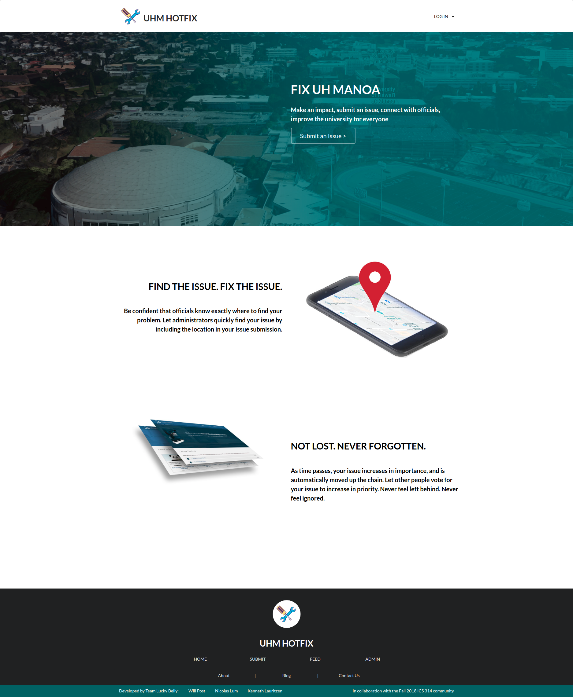
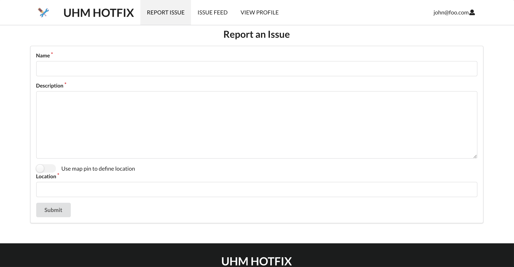
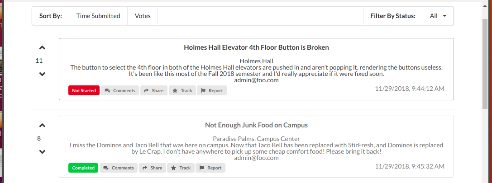

 
<kbd>

</kbd>
 

<kbd>

</kbd>
 

<kbd>

</kbd>
 

# UHM Hotfix
UHM Hotfix is a web application build for the students of University of Hawaii Manoa to report issues found around campus so 
students can contribute in improving their campus
 
<a href="https://uhm-hotfix.meteorapp.com"> The Site </a>  
<a href="https://uhm-hotfix.github.io"> Github IO Project Site </a>  

# Technologies Used 
UHM Hotfix is Build with Node.JS, the Meteor framework, the React Library, and MongoDB. 

# Features
<ul>
  <li> Lightning fast, simple to use interface. </li>
<li> Students are able to login using their uh username </li>
<li> Use of geolocation to automatically identify the location of the issue. </li>
<li> issues are organized by status of completion and degree of importance. </li>
<li> A Real-time feed of new problems and suggestions. </li>
<li> An fully featured Admin interface to manage problems and suggestions. </li>
</ul>

# Contributions

This project was completed by a team consisting of Kenneth Lauritzen, Nicolas Lum, and myself.
I completed the following: 
<ul>
  <li> Designed and implemented the database schema </li>
  <li> designed the admin interface </li>
  <li> contributed a significant portion of the UI for most of the pages of the project </li>
</ul>

# Conclusions

After completing this project, I felt much more comfortable using the React library and working in a Node.JS environment. This project also was my first experience with a noSQL database. The most satisfying part of working on this project was successfully collaborating with a strong team.

